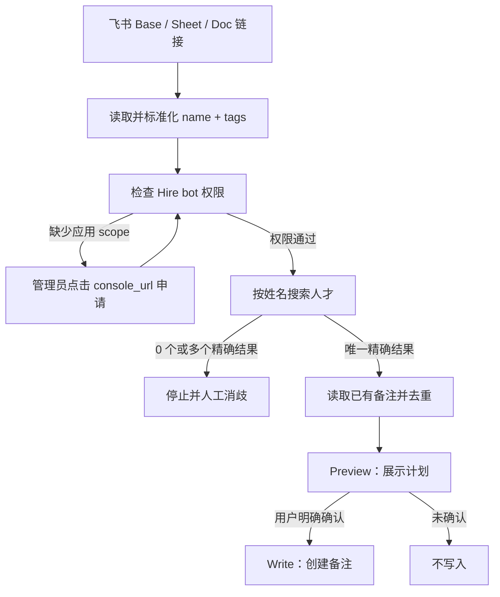

# lark-hire-note-tagger

把飞书 Base、电子表格或文档里的「候选人姓名 + 标签」安全地同步到飞书招聘（Feishu Hire）的人才备注中。

> 核心目标不是“批量写入越快越好”，而是确保标签写给正确的人、不会重复写、权限不足时能给出明确的一键申请入口，并且所有实际写入都经过预览和确认。

## 为什么需要这个 Skill

招聘团队经常在不同飞书资源里维护候选人标签，例如：

- Base 里记录「张三 → 产品经理、一面通过」
- Sheet 里维护批量候选人名单和人才画像标签
- Doc 里整理重点候选人及跟进结论

这些标签如果要同步到飞书招聘，通常需要招聘人员逐个搜索候选人、检查同名、查看已有备注、再手工复制。这个过程慢，而且有三个明显风险：

1. **同名写错人**：只按搜索结果第一条写入，可能污染另一个候选人的档案。
2. **重复备注**：批量任务重跑后，同样的标签会被写入多次。
3. **权限排障困难**：Hire 使用应用身份，应用 scope 和用户授权是两套机制；用错 token 或错误地执行 `auth login` 并不能解决 bot 权限。

`lark-hire-note-tagger` 把读取、匹配、消歧、去重、预览、确认和写入串成一个有安全门禁的流程。

## 能做什么

- 从飞书 Base、Sheet 或 Doc 链接读取候选人姓名和标签
- 使用 Hire 官方 OpenAPI 按姓名搜索人才
- 只接受姓名完全一致的结果
- 发现 0 个或多个同名结果时停止并请求人工消歧
- 分页读取已有备注，跳过完全相同的标签备注
- 明确区分私密备注和公开备注，不依赖 API 默认值
- 写入前生成预览，只有显式确认后才允许 POST
- 首次运行时检测应用 scope；缺失权限时返回开发者后台申请链接
- 输出逐人处理结果：已创建、已跳过、同名、未找到或 API 错误

## 设计原则

### 1. Hire 调用固定使用 bot 身份

飞书招聘 API 使用 `tenant_access_token`。因此所有 Hire 请求都通过：

```powershell
lark-cli api <METHOD> /open-apis/hire/v1/... --as bot
```

如果改用用户 token，Hire 会返回 `1002003 user access token not support`。

### 2. 权限申请和用户登录分开处理

Hire bot 权限来自飞书开发者后台的应用 scope。`lark-cli auth login` 处理的是用户授权，不能替应用申请 `hire:note`。

首次运行 `check_permissions.ps1` 时：

1. 只读探测 `hire:talent:readonly`
2. 只读探测备注权限
3. 如果收到 `99991672 app_scope_not_applied`，原样返回 `console_url`
4. 应用管理员点击链接申请权限
5. 再次运行检查

agent 无法绕过第 4 步，这是飞书的安全边界。

### 3. 姓名匹配宁可暂停，也不猜

Hire 的 `keyword` 是搜索而非唯一键。Skill 会在客户端再次过滤，只保留 `basic_info.name` 与输入姓名完全一致的记录：

- 0 条：`not_found`
- 1 条：允许继续
- 多条：`ambiguous`，等待用户选择 talent ID
- 分页达到安全上限：按 `ambiguous` 处理，不使用不完整结果

### 4. 预览与写入分成两个阶段

驱动脚本有三个模式：

| 模式 | 行为 | 是否写入 |
|---|---|---:|
| `SearchOnly` | 只搜索和匹配人才 | 否 |
| `Preview` | 匹配、读取备注、去重并输出计划 | 否 |
| `Write` | 再次去重后创建备注 | 是 |

`Write` 模式必须同时提供 `-ConfirmWrite`，否则脚本立即拒绝执行。

### 5. 幂等优先

默认备注格式为：

```text
候选人标签：产品经理、一面通过
```

如果该人才已有内容完全相同的备注，则返回 `skipped_duplicate`。不同内容的历史备注不会被修改或覆盖，新标签会作为一条新备注追加。

## 工作流



## 仓库结构

```text
.
├── README.md
└── skill/
    ├── SKILL.md
    ├── agents/
    │   └── openai.yaml
    ├── scripts/
    │   ├── check_permissions.ps1
    │   └── tag_talents.ps1
    └── references/
        └── hire_note_api.md
```

## 前置条件

- Windows PowerShell 5.1 或 PowerShell 7+
- 已安装并配置 `lark-cli`
- 飞书自建应用可以访问目标租户的招聘数据
- 应用具备以下 scope：

| 用途 | Scope |
|---|---|
| 搜索人才 | `hire:talent:readonly` 或 `hire:talent` |
| 创建备注 | `hire:note` |
| 只读备注 | `hire:note:readonly` 或 `hire:note` |

读取 Base、Sheet 或 Doc 时，还需要对应资源的用户授权和访问权限。

## 安装

克隆仓库后，把 `skill` 目录复制到本机 skills 目录：

```powershell
git clone https://github.com/CamellionKid/lark-hire-note-tagger.git
Copy-Item -Recurse .\lark-hire-note-tagger\skill "$env:USERPROFILE\.agents\skills\lark-hire-note-tagger"
```

重新打开 Codex 任务后，可通过 `$lark-hire-note-tagger` 显式调用。

## 使用方法

最常见的用法是直接给 agent 一条飞书链接：

```text
使用 $lark-hire-note-tagger，读取这个飞书 Base 里的候选人姓名和标签，
预览后把标签写成飞书招聘的私密备注：<飞书链接>
```

Skill 会自动路由到 `lark-base`、`lark-sheets` 或 `lark-doc` 读取来源数据，并在真正写入前请求确认。

### 1. 检查权限

```powershell
& .\skill\scripts\check_permissions.ps1
```

可能返回：

- `ready`：权限满足，可以继续
- `human_action_required`：需要管理员点击返回的 `console_url`
- `probe_failed`：探测失败，应先处理错误

### 2. 准备输入

```json
[
  {
    "name": "张三",
    "tags": ["产品经理", "一面通过"]
  },
  {
    "name": "李四",
    "tags": ["Java", "重点跟进"],
    "application_id": "可选的投递 ID"
  }
]
```

同名消歧完成后，可在对应记录中加入用户选择的 `talent_id`。脚本会回读该 ID 并验证姓名一致，不会直接信任覆盖值。

### 3. 只读匹配

```powershell
& .\skill\scripts\tag_talents.ps1 `
  -InputPath .\candidates.json `
  -Mode SearchOnly
```

### 4. 预览私密备注

```powershell
& .\skill\scripts\tag_talents.ps1 `
  -InputPath .\candidates.json `
  -Mode Preview `
  -Privacy 1
```

`Privacy` 必须明确指定：

- `1`：私密
- `2`：公开

### 5. 用户确认后写入

```powershell
& .\skill\scripts\tag_talents.ps1 `
  -InputPath .\candidates.json `
  -Mode Write `
  -Privacy 1 `
  -ConfirmWrite
```

## 输出状态

| 状态 | 含义 |
|---|---|
| `matched` | 唯一人才匹配成功 |
| `would_create` | 预览阶段将创建备注 |
| `created` | 备注创建成功 |
| `skipped_duplicate` | 已有相同备注，已跳过 |
| `ambiguous` | 有多个同名候选人或搜索结果未完整遍历 |
| `not_found` | 没有姓名完全一致的人才 |
| `invalid_input` | 姓名或标签为空 |
| `api_error` | Hire API 调用失败 |

## 安全边界

- 不输出 app secret 或 access token
- 不使用 user token 调用 Hire
- 不自动选择同名候选人
- 不自动把备注设为公开
- 不修改或覆盖既有备注
- 不在用户未确认时自动补加 `-ConfirmWrite`
- 不伪装已完成应用 scope 申请

## 已验证内容

- `quick_validate.py` 校验通过
- Windows PowerShell 5.1 和 PowerShell 7 均可解析和执行脚本
- Hire 人才搜索路径已通过 live tenant 的只读无结果测试
- 权限缺失时可正确识别 `app_scope_not_applied` 并返回申请链接
- Preview、去重、确认门禁和 POST 请求体已通过本地模拟测试

测试过程没有向 live tenant 创建候选人备注。

## 限制

- 仍需要人工处理同名候选人，这是刻意保留的安全门禁
- 应用管理员必须亲自完成开发者后台的 scope 申请
- 默认通过备注保存标签，不会修改飞书招聘原生的人才标签字段
- 目前脚本面向 Windows PowerShell 环境

## English summary

`lark-hire-note-tagger` reads candidate names and tags from Feishu Base, Sheets, or Docs, resolves each person in Feishu Hire, deduplicates existing notes, and creates a public or private note only after explicit preview and confirmation. Ambiguous names are never guessed, and missing app scopes are surfaced through the official developer-console application URL.
